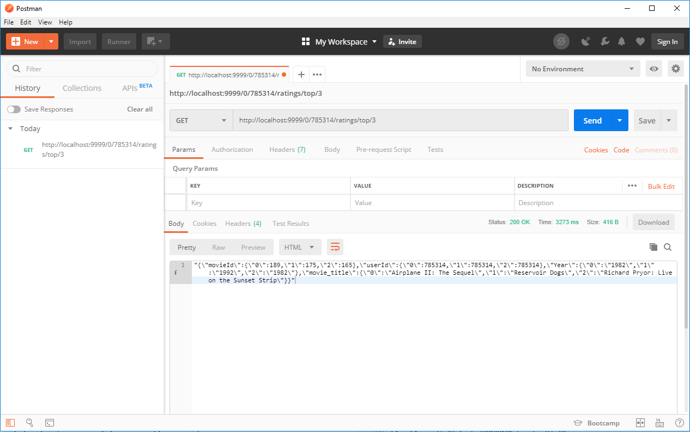
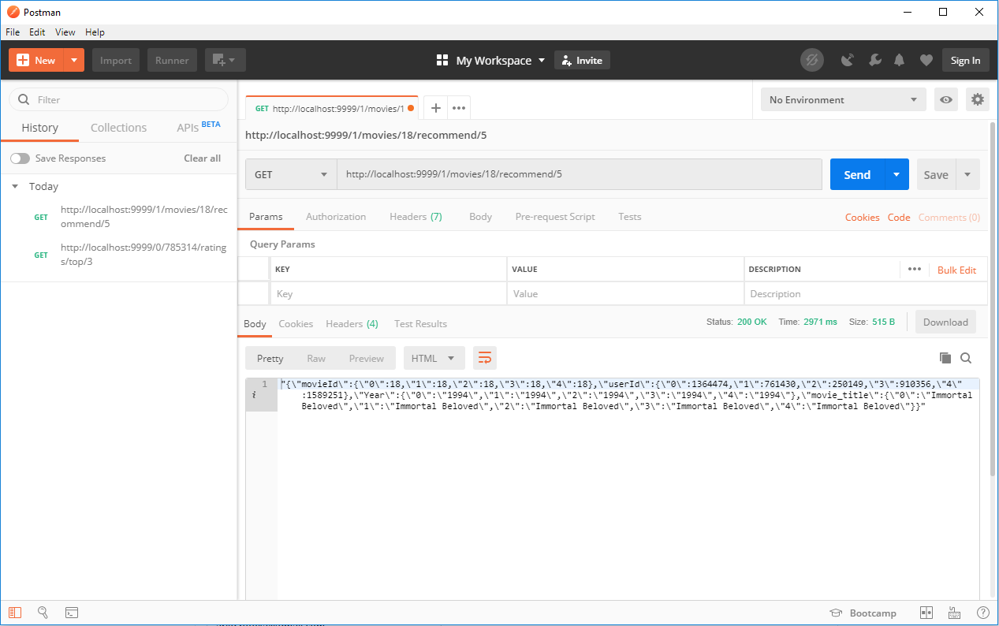
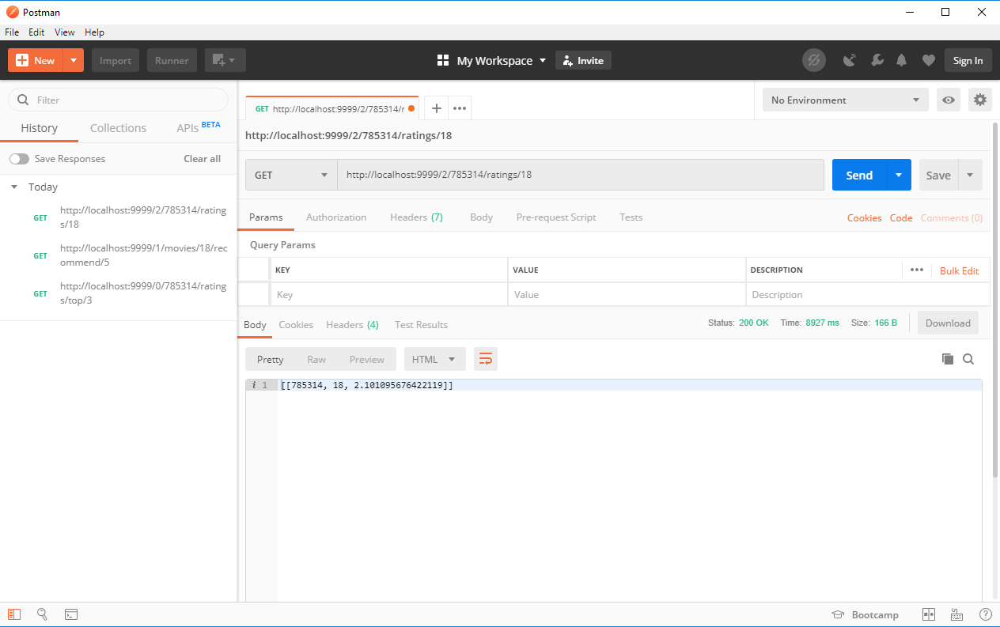
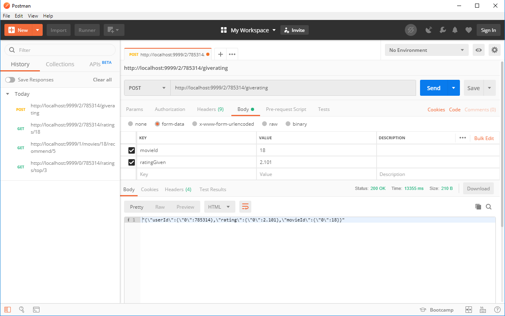
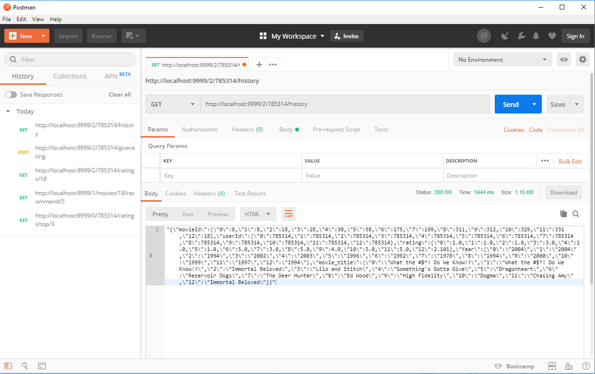

# Final Project for Big Data

## A brief description
An API for recomendation engine made in python utilizing spark and flask functionality based on the recomender engine made by github user "jadianes". The engine implmenents collaborative filtering algorithm to output recomendation based on it's calculation. Combined with the usage of Kafka to stream the data from producer to consumer. The dataset is streamed trough kafka in batches. The data which the consumer recieved will be the one processed by the recommendation engine.

## Preface
For this particular dataset i opted to preprocess the data first before i use it in the system. The preprocessing helps in finding the relevant data and to make the dataset easier to use. The preprocessing algorithm can be seen in the notebook folder.

## Files Contained

#### server.py
Initialises a CherryPy web server for app.py and create Spark Context for engine.py

#### app.py
Flask web app that define RESTful API and its functionality 

#### engine.py
Define the Reccomendation Engine and wrapping all spark related computation 

#### producer.py
Acts as the kafka's "producer", will send data in batches to consumer

#### consumer.py
Acts as the kafka's "consumer", recieve data from the kafka server to use as the dataset for the engine

## Specification

### The batch limit for data sent in kafka is 500,000 rows of data
### Model used:
1. Model 1: First 1/3 of data
2. Model 2: First 2/3 of data
3. Model 3: All of the data

### Accessible API endpoint
The API runs on localhost (0.0.0.0) on port number 9999.

## Running the System
1. Start zookeeper and kafka
2. Make a new topic in kafka, this project uses a topic named "netflixdata"
```
kafka-topics.bat --create --zookeeper localhost:2181 --replication-factor 1 --partitions 1 --topic netflixdata
```
4. Start producer.py
5. Start consumer.py
6. Consumer will start getting data, wait until you have approximately the desired amount of data you want
7. Start server.py

### Available API requests

#### Note : <model_id> determines the model used (0, 1 or 2). Change this value to the corresponding model that you want to use.

#### http://localhost:9999/<model_id>/<user_id>/ratings/top/<count_num> 
  method = [GET]
  <br>
  Display <count_num> number of movies recomended for <user_id>
  <br>
  
  
#### http://localhost:9999/<model_id>/movies/<movie_id>/recommend/<count_num> 
  method = [GET]
  <br>
  Display <count_num> number of user(s) which the system recomends <movie_id> to.
  <br>
  
  
#### http://localhost:9999/<model_id>/<user_id>/ratings/<movie_id> 
  method = [GET]
  <br>
  Display system prediction regarding the rating for <movie_id> that <user_id> will give.
  <br>
  
  
#### http://localhost:9999/<model_id>/<user_id>/giverating 
  method = [POST]
  <br>
  <user_id> submits a rating for a film. Parse "movieId" and "ratingGiven" in the body of the POST request.
  <br>
  
  
#### http://localhost:9999/<model_id>/<user_id>/history 
  method = [GET]
  <br>
  Display the <user_id>'s movie rating history.
  <br>
  

### More API Request(s) may be added in the future.
