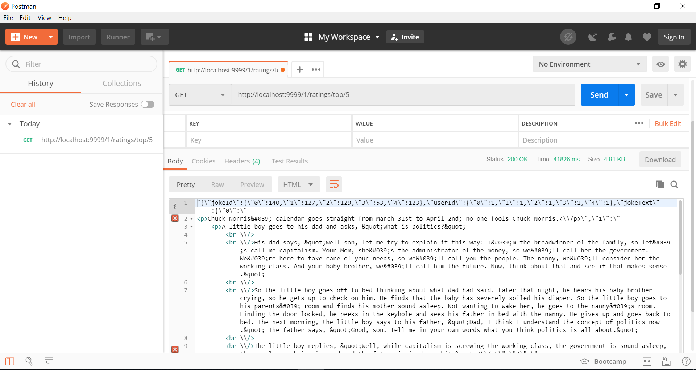

# Recommendation Engine API

## A brief description
A recomendation engine made in python utilizing spark and flask functionality. Based on the recomender engine made by github user "jadianes". This engine implmenents collaborative filtering algorithm to output recomendation based on it's calculation. For example the recomender system can output the predicted score that a user will give to a joke that they have not heard of based on their other ratings and also other user's ratings.

### Files Contained

#### Server.py
Initialises a CherryPy web server for app.py and create Spark Context for engine.py

#### App.py
Flask web app that define RESTful API and its functionality 

#### Engine.py
Define the Reccomendation Engine and wrapping all spark related computation 

#### How to run :
1. Run 'python server.py'
2. "Recomender Engine is running on localhost port 9999!" will be displayed if the engine is up and running.

## Accessible URL
The endine runs on localhost (0.0.0.0) on port number 9999.

### Options

#### http://localhost:9999/<user_id>/ratings/top/<count> 
  method = [GET]
   
  Display <count> number of jokes recomended for <user_id>
  
#### http://localhost:9999/jokes/<joke_id>/recommend/<count> 
  method = [GET]
   
  Display <count> number of user which the system recomends <joke_id> to.
  
#### http://localhost:9999/<user_id>/ratings/<joke_id> 
  method = [GET]
   
  Display system prediction regarding the rating for <joke_id> that <user_id> will give.
  
#### http://localhost:9999<user_id>/giverating 
  method = [POST]
   
  <user_id> submits a rating for a film. Parse "jokeId" and "ratingGiven" in the body of the POST request.
  
#### http://localhost:9999/<user_id>/history 
  method = [GET]
   
  Display the <user_id>'s joke rating history.

## Test Screenshots using Postman
  
   
  
   
  
   
  
   
  
